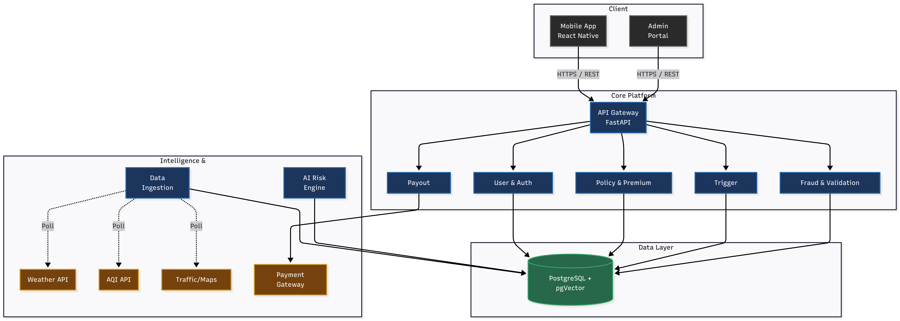
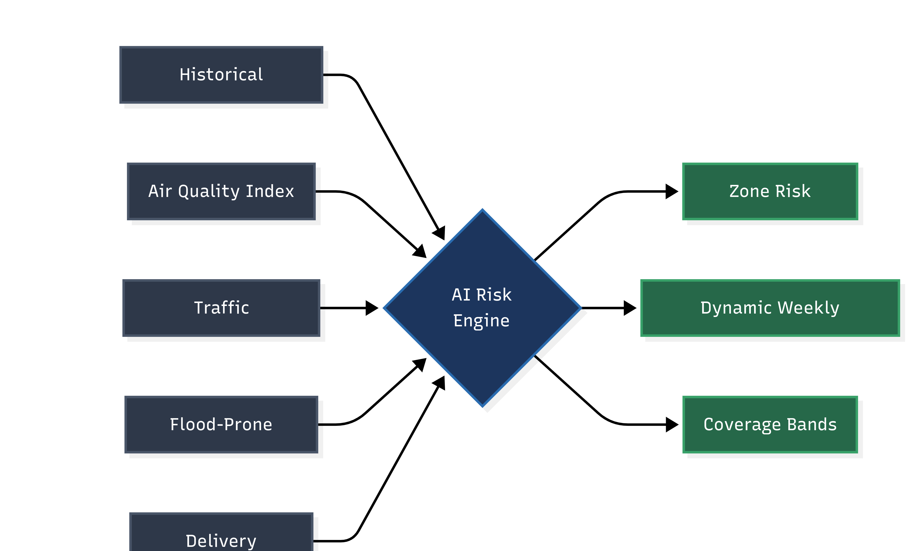
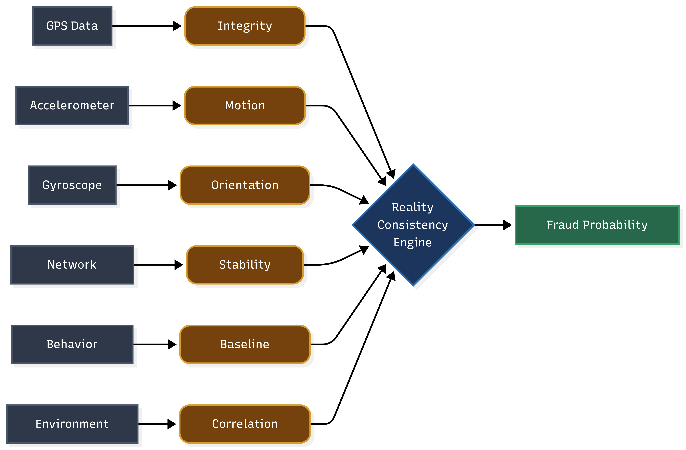

# giggity

### AI-Powered Parametric Income Insurance for Gig Workers

[]()
[](https://python.org)
[](https://fastapi.tiangolo.com)
[](https://reactnative.dev)
[](https://postgresql.org)
[](https://github.com/pgvector/pgvector)

**giggity** is an AI-driven **parametric income insurance** platform for gig workers. The goal is to detect real-world disruptions (rain, heat, AQI spikes, lockdowns), validate impact, and trigger fast payouts with minimal user friction.

This repository currently documents what we are going to build and how the final product is expected to work.

---

## Table of Contents

- [Current Status](#current-status)
- [Problem Statement](#problem-statement)
- [What We Are Building](#what-we-are-building)
- [Product Principles](#product-principles)
- [Target User Experience](#target-user-experience)
- [System Blueprint](#system-blueprint)
- [Core Components](#core-components)
- [Adversarial Defense & Anti-Spoofing Strategy](#adversarial-defense--anti-spoofing-strategy)
- [Technology Stack](#technology-stack)
- [Planned Repository Structure](#planned-repository-structure)
- [Delivery Plan](#delivery-plan)
- [Milestones and Acceptance Criteria](#milestones-and-acceptance-criteria)
- [Planned API Surface](#planned-api-surface)
- [Security and Compliance Plan](#security-and-compliance-plan)
- [Observability Plan](#observability-plan)
- [Business Model Hypothesis](#business-model-hypothesis)
- [Roadmap](#roadmap)

## Current Status

- Product stage: pre-build
- Purpose of this README: product definition + engineering blueprint

As implementation begins, this document will evolve from blueprint to developer and operator documentation.

## Problem Statement

India's gig economy employs over **15 million platform-based delivery workers**. These workers are acutely exposed to income loss from external disruptions entirely outside their control:

| Disruption                      | Income Impact                      |
| ------------------------------- | ---------------------------------- |
| Heavy rainfall / flooding       | Unable to ride, fewer or no orders |
| Extreme heat (>42C)             | Reduced safe operating hours       |
| Severe air pollution (AQI >350) | Health advisories reduce activity  |
| Local curfews / civic events    | Zone access restrictions stop work |

Conventional insurance generally does not address short-window, disruption-driven income gaps.

## What We Are Building

We plan to build a parametric insurance product that:

1. Prices risk at hyperlocal zone level
2. Monitors disruption signals continuously
3. Triggers claims automatically from predefined rules
4. Validates consistency to reduce fraud and spoofing
5. Disburses payouts quickly through digital rails

The intended end state is a low-friction protection layer for workers, with minimal manual claims overhead.

## Product Principles

| Principle                | Design Intent                                                  |
| ------------------------ | -------------------------------------------------------------- |
| Income-focused coverage  | Protect earnings loss from disruptions, not property or health |
| Weekly product cadence   | Match gig worker earnings cycles and flexibility               |
| Automation-first         | Trigger-to-payout flow minimizes manual operations             |
| Fraud-aware architecture | Multi-signal validation without penalizing genuine users       |
| Transparent decisions    | Explainable trigger and payout outcomes                        |

## Target User Experience

Planned worker journey:

1. Onboard and complete KYC
2. View weekly quote for active zone
3. Purchase protection for the coming week
4. Continue normal gig work with no additional action
5. Receive automatic payout when disruption rules are met and validation passes

Planned admin journey:

1. Monitor trigger events and payout health
2. Review flagged fraud clusters
3. Tune operational thresholds and policies

## System Blueprint

### High-Level Flow (Target)



### Planned Service Decomposition

| Service        | Planned Responsibility                          | Planned Language               |
| -------------- | ----------------------------------------------- | ------------------------------ |
| api-gateway    | Auth, routing, rate limiting                    | Python / FastAPI               |
| user-service   | Registration, KYC, worker profiles              | Python / FastAPI               |
| policy-service | Weekly policy lifecycle and pricing consumption | Python / FastAPI               |
| risk-engine    | Zone risk scoring and premium recommendations   | Python / Scikit-learn, XGBoost |
| trigger-engine | Parametric condition evaluation                 | Python / FastAPI               |
| fraud-service  | Reality consistency checks and fraud scoring    | Python / FastAPI               |
| payout-service | Disbursement orchestration                      | Python / FastAPI               |
| data-ingestion | Weather, AQI, traffic, and civic data ingestion | Python                         |
| mobile-app     | Worker-facing app                               | React Native                   |
| admin-portal   | Operations dashboard for monitoring and review  | React / Next.js                |

## Core Components

### 1) Hyperlocal Risk Engine

- Operational geography split into 500m to 1km H3 cells
- Weekly score per cell based on disruption history and signal quality
- Output feeds policy pricing and coverage tiers



Illustrative pricing model (subject to validation):

| Risk Level | Zone Conditions                | Weekly Premium | Coverage |
| ---------- | ------------------------------ | -------------- | -------- |
| Low        | Stable weather and open routes | INR 20         | INR 300  |
| Medium     | Moderate disruption history    | INR 30         | INR 400  |
| High       | Flood or heat exposed zones    | INR 45         | INR 500  |

### 2) Trigger Engine

Planned cadence: evaluate rules every 5 minutes per zone.

| Disruption Type | Candidate Condition                | Candidate Data Source        |
| --------------- | ---------------------------------- | ---------------------------- |
| Heavy Rainfall  | Rainfall > 70mm in 24h             | OpenWeatherMap               |
| Extreme Heat    | Temperature > 42C sustained for 3h | OpenWeatherMap               |
| Air Pollution   | AQI > 350                          | OpenAQ / CPCB                |
| Flash Flood     | Rainfall spike + mobility slowdown | Weather + traffic provider   |
| Zone Lockdown   | Civic event + activity collapse    | Admin feed + platform signal |

### 3) Reality Consistency Engine

Multi-signal anti-spoofing checks are planned across:

- GPS stability versus expected drift
- Motion sensor noise patterns
- Network handoff behavior
- Activity behavior against local disruption context



Illustrative score policy (to be tuned):

| RCE Score | Planned Action                  |
| --------- | ------------------------------- |
| 0-30%     | Full payout                     |
| 30-60%    | Partial payout + silent review  |
| 60-80%    | Delayed payout + verification   |
| >80%      | Hold and investigation workflow |

### 4) Coordinated Fraud Detection (Planned)

Cluster-level detection candidates:

- Similar movement signatures across multiple accounts
- Synchronized claim timing against the same trigger window
- Shared device, network, or account-link indicators

## Adversarial Defense & Anti-Spoofing Strategy

Crisis context: 

>Coordinated fraud rings using Telegram groups and GPS spoofing can drain a parametric liquidity pool if location is treated as a single source of truth.

Solution approach:

Our architecture already treats raw GPS as a weak signal and requires cross-signal consistency before high-confidence payouts.

### 1) The Differentiation

How we distinguish genuinely stranded workers from spoofing actors:

- Multi-signal consistency scoring: each claim is evaluated using device, network, environmental, and behavioral evidence, not location alone.
- Temporal realism checks: genuine disruption behavior evolves over time, while spoofing tends to show abrupt or repetitive patterns.
- Zone-level cohort comparison: claims are benchmarked against nearby workers in the same window; isolated anomalies are down-weighted.
- Hybrid decisioning: rules plus ML classify outcomes into likely genuine, uncertain, or likely spoofed using calibrated thresholds.

### 2) The Data

Data points beyond basic GPS coordinates used to detect coordinated fraud:

- Device telemetry: accelerometer variance, gyroscope patterns, motion continuity, and sensor health signatures.
- Network signals: cell-tower handoffs, ASN and IP reputation, VPN or proxy indicators, and latency jitter expected in severe weather.
- Spatiotemporal traces: route plausibility, speed profile, stop duration, improbable jumps, and geohash transition entropy.
- Environmental correlation: weather severity, traffic slowdown, demand contraction, and peer activity drops in the same zone.
- Identity and graph links: device fingerprint reuse, account or payout clustering, and synchronized claim timing in suspicious cohorts.
- Historical baseline: worker-specific route and activity history to detect sudden adversarial drift.

### 3) The UX Balance

How we handle flagged claims without penalizing honest workers:

- Risk-tiered outcomes:
  - Low-risk claims receive instant payout.
  - Medium-risk claims receive partial or capped payout immediately with silent review.
  - High-risk claims are delayed for expedited verification.
- Weather-aware tolerance: short signal drops in bad weather are treated as expected noise, not automatic fraud.
- Transparent status updates: users see clear claim states such as processing, partial release, or under verification.
- Human review safeguards: no final denial from a single model output; high-risk cases route to analyst review and appeal.
- Cluster containment: controls narrow to suspicious rings rather than freezing payouts for an entire zone.

## Technology Stack

### Backend

| Layer         | Planned Technology    |
| ------------- | --------------------- |
| API Framework | FastAPI               |
| Runtime       | Python 3.13+          |
| Queue         | Celery + Redis        |
| ML            | Scikit-learn, XGBoost |
| ORM           | SQLAlchemy + Alembic  |
| Data          | PostgreSQL + pgvector |

### Frontend

| Layer        | Planned Technology |
| ------------ | ------------------ |
| Mobile App   | React Native       |
| Admin Portal | Next.js            |
| State        | Zustand            |

### Infrastructure

| Layer         | Planned Technology                 |
| ------------- | ---------------------------------- |
| Containers    | Docker                             |
| Orchestration | Kubernetes                         |
| CI/CD         | GitHub Actions                     |
| Secrets       | Vault or cloud secret manager      |
| Observability | OpenTelemetry, Prometheus, Grafana |

### External Integrations (Planned)

| Domain      | Candidate Providers         |
| ----------- | --------------------------- |
| Weather     | OpenWeatherMap              |
| Air Quality | OpenAQ / CPCB               |
| Traffic     | Google Maps Platform / HERE |
| Payments    | Razorpay                    |
| KYC         | DigiLocker / Setu API       |

---

## Planned Repository Structure

The structure below is the intended target layout as implementation starts:

```text
giggity/
|- apps/
|  |- mobile/
|  \- admin/
|- services/
|  |- api-gateway/
|  |- user-service/
|  |- policy-service/
|  |- risk-engine/
|  |- trigger-engine/
|  |- fraud-service/
|  |- payout-service/
|  \- data-ingestion/
|- shared/
|- infra/
|- db/
|- ml/
|- tests/
|- docs/
\- README.md
```

---

## Delivery Plan

### Stage 0: Foundation and Design

- Finalize product rules and policy terms
- Define service contracts and domain model
- Establish coding standards, CI baseline, and repo scaffolding

### Stage 1: MVP Build

- API gateway and auth
- Worker onboarding and policy purchase
- Initial trigger engine (weather + AQI)
- Basic payout workflow in sandbox mode

### Stage 2: Trust and Intelligence

- Hyperlocal risk scoring pipeline
- Reality consistency anti-spoofing engine
- Fraud cluster detection and analyst workflows

### Stage 3: Production Readiness

- Reliability hardening, SLOs, and alerting
- Security controls and compliance checks
- Controlled rollout for pilot city

---

## Milestones and Acceptance Criteria

| Milestone | Outcome                   | Acceptance Criteria                                     |
| --------- | ------------------------- | ------------------------------------------------------- |
| M1        | Project skeleton ready    | Core services scaffolded and CI runs lint and tests     |
| M2        | End-to-end happy path     | Worker can onboard, buy policy, and receive test payout |
| M3        | Trigger quality baseline  | Trigger precision and recall thresholds agreed and met  |
| M4        | Fraud controls integrated | RCE scoring and manual review path operational          |
| M5        | Pilot launch readiness    | Security, observability, and runbooks signed off        |

---

## Planned API Surface

These are proposed endpoints (subject to change during implementation):

### Auth

- POST /api/v1/auth/register
- POST /api/v1/auth/token
- POST /api/v1/auth/refresh

### Policy

- GET /api/v1/policy/quote
- POST /api/v1/policy/create
- GET /api/v1/policy/{id}
- GET /api/v1/policy/active

### Claims

- GET /api/v1/claims
- GET /api/v1/claims/{id}

### Zones and Risk

- GET /api/v1/zones/{lat}/{lng}
- GET /api/v1/zones/heatmap

### Admin

- GET /api/v1/admin/metrics
- GET /api/v1/admin/fraud/alerts
- GET /api/v1/admin/triggers

---

## Security and Compliance Plan

- JWT-based auth with role-based access control
- Encryption in transit and at rest for PII and financial data
- Payment processor isolation for PCI scope reduction
- Audit logging for claim and payout decisions
- India DPDP-aligned data handling principles

---

## Observability Plan

Planned telemetry:

- Metrics for trigger volumes, payout latency, and fraud score distribution
- Structured logs for policy, trigger, claim, and payout events
- Distributed tracing across gateway and downstream services

Target operational outcomes:

- Fast detection of trigger lag and payout failures
- Visibility into model drift and fraud false positives
- Actionable dashboards for operations and risk teams

---

## Business Model Hypothesis

Illustrative model:

- 10,000 active workers x INR 30 weekly premium = INR 300,000 weekly gross premium
- Expected loss ratio target: 45% to 55%
- Unit economics and pricing will be calibrated with pilot data

Scale hypothesis:

| Stage          | Workers   | Weekly Premium Volume |
| -------------- | --------- | --------------------- |
| Pilot          | 1,000     | INR 30,000            |
| City rollout   | 10,000    | INR 300,000           |
| Multi-city     | 100,000   | INR 3,000,000         |
| National scale | 1,000,000 | INR 30,000,000        |

---

## Roadmap

### Phase 1: Foundation (MVP)

- [ ] API gateway and auth service
- [ ] Policy creation and baseline premium logic
- [ ] Trigger engine v1 (weather + AQI)
- [ ] Fraud scoring v1 (basic behavioral checks)
- [ ] Payment integration in sandbox mode
- [ ] Mobile app v1 (worker)
- [ ] Admin portal v1 (metrics + alerts)

### Phase 2: Intelligence

- [ ] Hyperlocal H3 risk engine v1
- [ ] Reality Consistency Engine v1
- [ ] Fraud ring detection workflows
- [ ] Production-grade external data integrations
- [ ] UPI payout production launch

### Phase 3: Scale

- [ ] Multi-platform support
- [ ] Multi-city calibration and rollout
- [ ] KYC automation improvements
- [ ] Regulatory sandbox and approval tracks
- [ ] B2B platform integration APIs

### Phase 4: Ecosystem

- [ ] Earnings smoothing product extension
- [ ] Complementary protection bundles
- [ ] Open disruption intelligence APIs

---

This README intentionally describes the intended product and implementation path. Operational runbooks, deploy commands, and test execution instructions will be added once implementation exists.

## Current MVP Runbook (Implemented)

The repository now includes a working MVP for:

- Worker onboarding
- Pandemic-aware quote pricing
- Payment checkout and confirmation simulation
- Policy activation after successful payment
- Trigger simulation with automated claim and payout lifecycle

### Local Setup

Backend:

```bash
cd backend
pip install -e .
uvicorn app.main:app --reload --port 8000
```

Frontend:

```bash
cd apps/web
npm install
npm run dev
```

Open:

- Frontend: http://localhost:3000
- Backend docs: http://localhost:8000/docs

### Seed Demo Worker

You can create a ready-to-test worker profile and active policy:

- `POST /api/v1/admin/seed-demo`

Sample payload:

```json
{
  "name": "Demo Worker",
  "email": "demo.worker@giggity.dev",
  "phone": "+910000000000",
  "zone": "ZONE_A",
  "create_active_policy": true
}
```

### End-to-End MVP Validation

1. Register or seed a worker.
2. Fetch quote with pandemic context:
  - `GET /api/v1/policy/quote?zone=ZONE_A&disruption_context=PANDEMIC`
3. Run payment flow:
  - `POST /api/v1/payments/checkout`
  - `POST /api/v1/payments/confirm`
4. Verify active policy:
  - `GET /api/v1/policy/active/{user_id}`
5. Simulate pandemic trigger:
  - `POST /api/v1/admin/triggers` with `trigger_type=PANDEMIC`
6. Verify lifecycle and payouts:
  - `GET /api/v1/claims/lifecycle/{user_id}`
  - `GET /api/v1/payouts/{user_id}`

### Current MVP API Additions

- `GET /health`
- `POST /api/v1/payments/checkout`
- `POST /api/v1/payments/confirm`
- `GET /api/v1/payments/{user_id}`
- `POST /api/v1/admin/seed-demo`
- `GET /api/v1/claims/lifecycle/{user_id}`
- `GET /api/v1/payouts/{user_id}`

---
